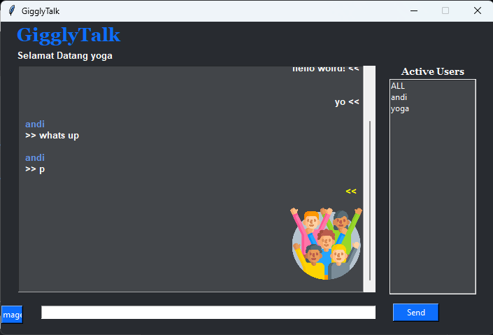
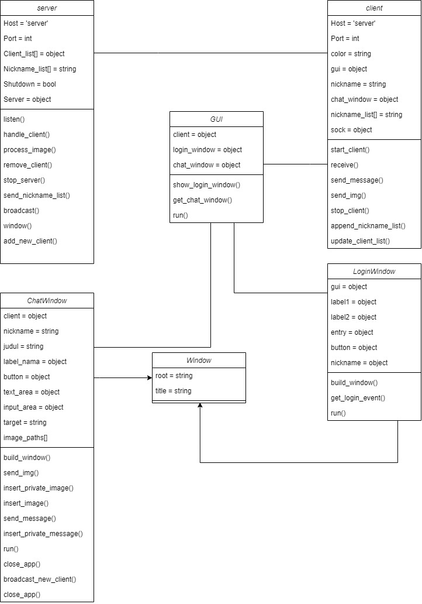
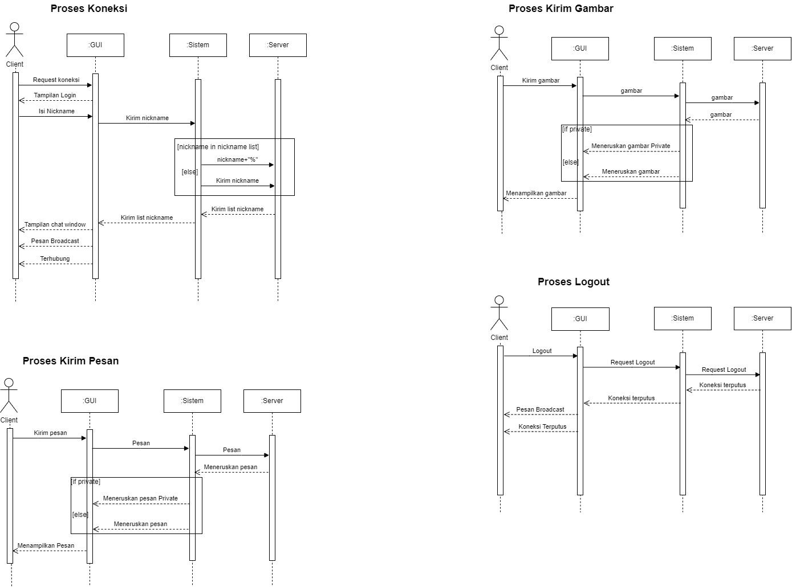

<h1 align=center>OOP'S PROJECT - CHAT APP USING TKINTER</h1>

## KELOMPOK 5 Rombel 1 PTIK 2022
## ANGGOTA KELOMPOK
1. Muhammad Zidqi Asegaf - 5302422010
2. Zakia Anis Murzaqoh - 5302422022
3. Naufal Muhammad - 5302422040
4. Fausta Reyhan Favian - 5302422041

## FITUR
1. Send message
2. Send private message
3. Send image
4. Send private image

## HOW TO USE
1. Pastikan python sudah terinstall modul berikut.
   ```
     Pillow==9.5.0
   ```
    #### Atau bisa juga dengan menginstall [requirement.txt](https://github.com/farrelekaputra/tugasPBO/blob/main/requirements.txt) dengan perintah 
   Use the package manager [pip](https://pip.pypa.io/en/stable/) to install the modules from requirements.txt
      ```bash
      pip install -r /path/to/requirements.txt
      ```
2. Kemudian buat folder dengan nama "images" dan edit pada kata "path" di file server.py berikut dengan menyesuaikan folder yang anda gunakan.
   ```
      def process_image(self, message):
        try:
            with Image.open(message[2]) as img:
                png_temp_path = os.path.join("path/images",
                                             os.path.basename(message[2]).replace(os.path.splitext(message[2])[1],
                                                                                   '.png')).replace("\\", "/")
                message = f"{message[0]};{message[1]};{png_temp_path};{message[3]};{message[4]}"
                img.save(png_temp_path, format="PNG")
                return message
        except Exception as e:
            print(f"[!] Error process image: {e}")
   ```
3. Kemudian untuk menjalankan aplikasi dengan run file server.py.
4. Kemudian akan muncul window untuk server.
5. Klik tombol "Add" untuk menambahkan client.
6. Setelah itu akan muncul window login untuk client. Masukan username client dan tekan tombol login.
7. Ketik pesan pada text input untuk mengirim pesan. Jika ingin mengirim gambar, maka tekan tombol "image" kemudian pilih gambar yang akan dikirim.
8. Tekan tombol "Add" lagi pada window server untuk menambah client lainya.
9. Jika ingin menutup client dan server, cukup tekan tombol silang pada window.

## SCREENSHOOT
<details><summary><h3>Screenshot 1</h3></summary>
<div align=center>


</div>
</details>
<details><summary><h3>Screenshot 2</h3></summary>
<div align=center>


</div>
</details>

## DIAGRAMS
<details><summary><h3>USE CASE</h3></summary>
<div align=center>


</div>
</details>

<details><summary><h3>ACTIVITY</h3></summary>
<div align=center>


</div>
</details>

<details><summary><h3>CLASS DIAGRAM</h3></summary>
<div align=center>


</div>
</details>

<details><summary><h3>SEQUENCE DIAGRAM</h3></summary>
<div align=center>


</div>
</details>
